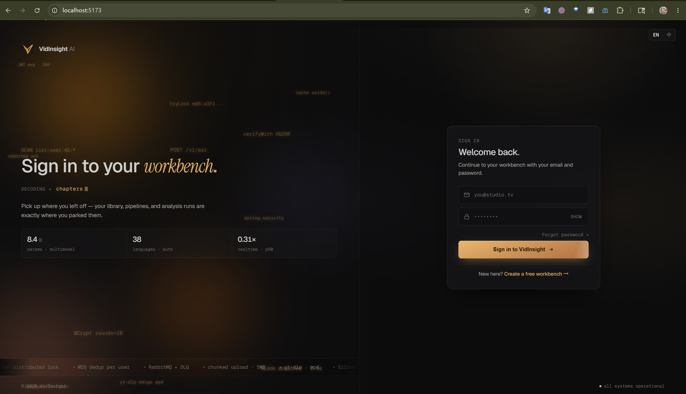
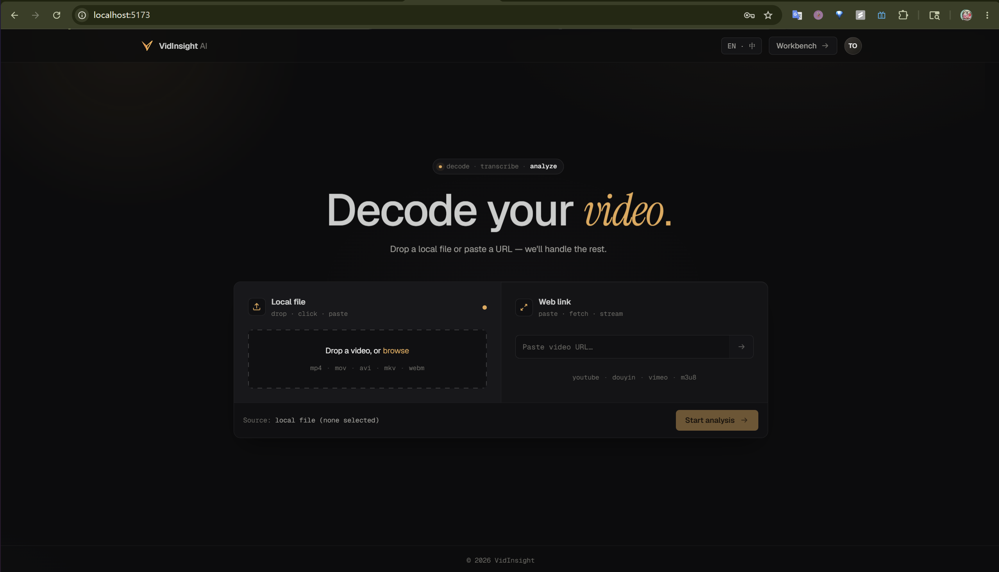
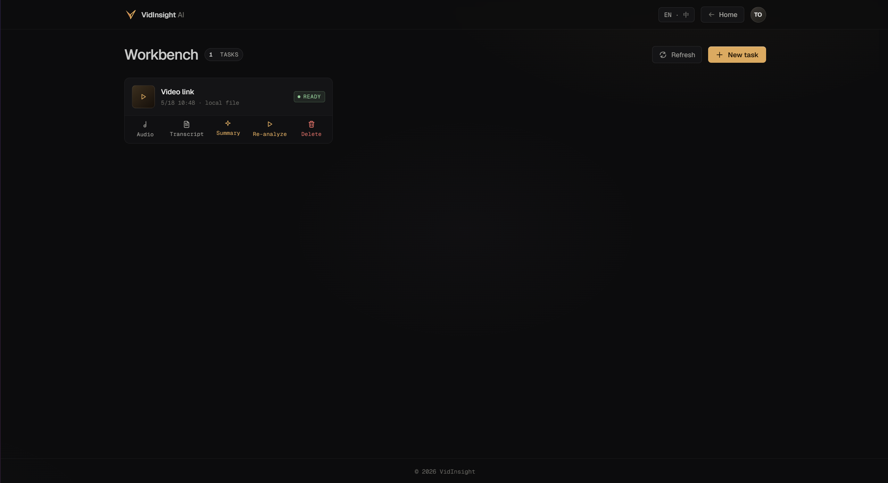
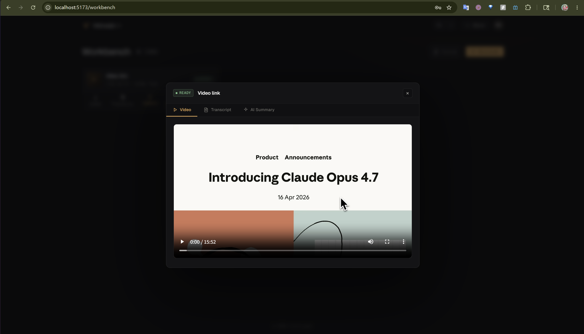
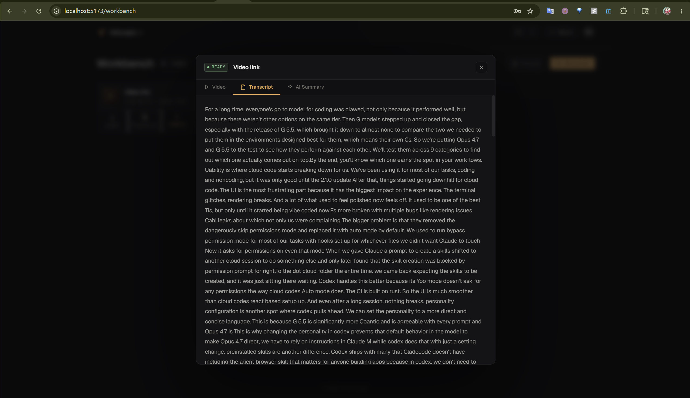
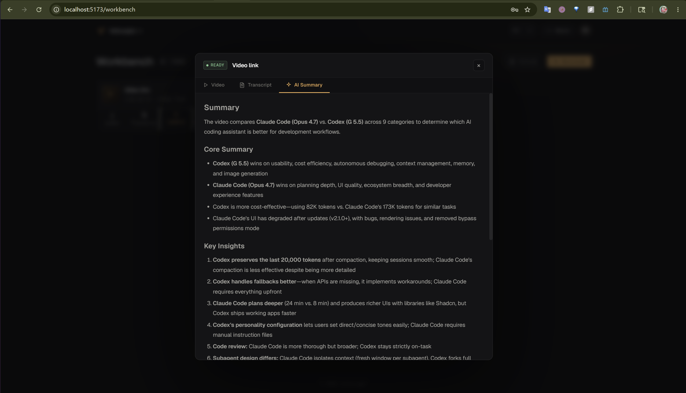
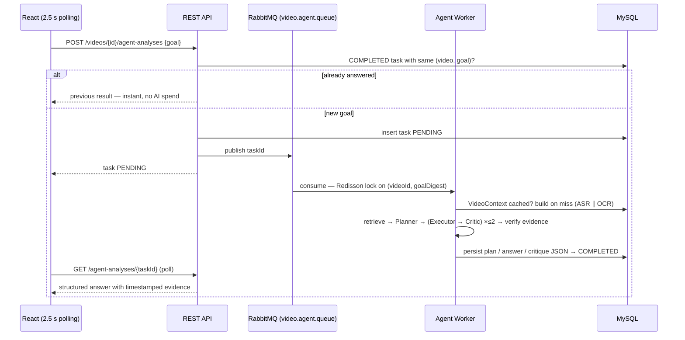
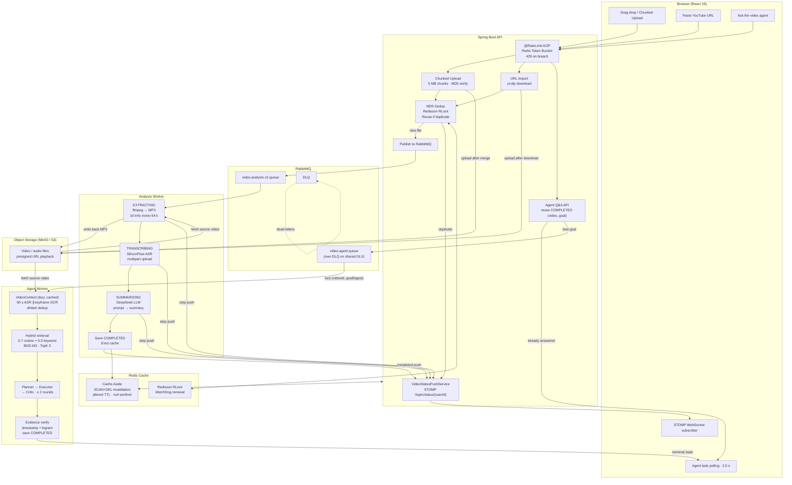

<div align="center">

<h1>VidInsight AI</h1>

<p><strong>Full-stack video analysis platform powered by LLM transcription & summarization</strong></p>

<p>
  <a href="README_CN.md">中文文档</a> ·
  <a href="#quick-start">Quick Start</a> ·
  <a href="#architecture">Architecture</a>
</p>

<p>
  
  
  
  
  
  
  
  
  
</p>

</div>

---

**VidInsight AI** is a full-stack video intelligence platform that extracts transcripts and generates AI summaries from any video — local file or YouTube URL. Built around an async pipeline with real-time progress feedback, it handles the engineering details you'd actually face in production: distributed deduplication, cache consistency, rate limiting, and resumable uploads. Every analyzed video also supports **goal-driven, evidence-constrained Q&A** through a built-in multimodal agent — see [Video Q&A Agent](#video-qa-agent).

---

## Preview

### Demo
End-to-end flow: paste a YouTube URL → realtime three-phase pipeline → AI summary.


### Landing Page
Marketing hero — login / register entry with JWT-based auth.



### Upload Page
Drag-drop file upload + URL import (YouTube and other platforms).



### Workbench
Per-user video task list with live status and real-time progress.



### Detail Modal — Video Tab
Embedded original video for side-by-side reference while reviewing results.



### Detail Modal — Transcript Tab
Full ASR transcript powered by SiliconFlow (SenseVoiceSmall).



### Detail Modal — AI Summary Tab
Structured summary generated by DeepSeek-V4-Flash.



### Detail Modal — AI Q&A Tab
Ask the agent anything about the video; answers come back with plan, conclusions and timestamped evidence.


---

## Core Features

### Resilient Upload
- **Chunked upload** — 5 MB chunks with MD5 verification on merge; survives flaky connections
- **URL import** — yt-dlp downloads YouTube/web videos in the background; STOMP push notifies the frontend when done
- **MD5 deduplication** — if the same file is uploaded twice (same user), the existing ASR + LLM result is reused instantly (Redisson distributed lock prevents race conditions)

### Real-time Pipeline
- **Three-phase progress** — `EXTRACTING → TRANSCRIBING → SUMMARIZING` stages pushed to the browser over WebSocket/STOMP; no polling
- **RabbitMQ async decoupling** — upload API returns in < 100 ms; analysis runs in a separate consumer thread pool with DLQ

### Security & Multi-tenancy
- **Stateless JWT auth** — Spring Security 6 filter chain, HS256, 24 h expiry, BCrypt password hashing
- **Per-user data isolation** — every DB query and cache key is scoped to `userId`; MD5 dedup never leaks results across users

### Redis Engineering
- **Cache Aside** — full write-path invalidation via `SCAN + DEL` (not `KEYS`); null-sentinel for penetration; jittered TTL for avalanche prevention; Redisson RLock with WatchDog for hot-key breakdown
- **Token-bucket rate limiting** — Redis Lua script, `@RateLimit` AOP annotation, per-user and per-IP dimensions, `HTTP 429` on breach

---

## Video Q&A Agent

Beyond automatic transcription and summarization, every analyzed video supports **goal-driven, evidence-constrained Q&A**: ask anything ("list all key points with timestamps") and get a structured answer — plan, conclusions, timestamped evidence, suggestions — where every important claim must be backed by a timestamp that actually exists in the video. Click a piece of evidence and you know exactly where to look.


### Multimodal VideoContext — lazy-built, goal-agnostic

- The audio track is split into **60-second MP3 segments** (ffmpeg) and transcribed per segment, so every sentence carries a timestamp — the raw material for evidence
- **Scene-detection keyframes** (`scene > 0.35`, plus a 30 s fallback and frame 0) are OCR'd by **Tesseract** (`chi_sim+eng`) to capture slides, whiteboards and on-screen text the audio never mentions
- A **dHash perceptual fingerprint** (Hamming distance ≤ 5) drops near-identical frames *before* paying the OCR cost
- ASR and OCR branches run **in parallel** and merge into 60-second windows; a single branch failing is tolerated, and the merged context is persisted as JSON **per video, once** — built lazily on the first question, so a video nobody asks about never pays the cost

### Planner / Executor / Critic loop — at most 2 rounds

- **Planner** decomposes the goal into 3–5 subtasks → **Executor** answers strictly from the retrieved context → **Critic** checks completeness and evidence grounding
- A failed critique drives **one targeted retry**: the Critic's feedback — including which timestamp ranges are missing evidence — is fed back into retrieval for round 2
- **Programmatic evidence verification is the final gate**: every evidence timestamp must fall inside a real segment and its content must overlap the transcript (bigram similarity ≥ 0.5). The Critic is an LLM too — it can hallucinate right along with the Executor, so the last check is plain code, not another model

### Hybrid retrieval for long videos — no vector DB

- Long videos are chunked at **5-minute granularity** with LLM chunk summaries, embedded via SiliconFlow `BAAI/bge-m3`, and persisted next to the context
- Retrieval score = **0.7 × local cosine + 0.3 × keyword overlap**, TopK = 3; if the embedding call fails, retrieval degrades to keyword-only and the pipeline keeps going
- A deliberate trade-off: at TopK = 3 over a single machine's data, local cosine beats operating a vector database. The interface stays, so one can be swapped in when scale demands it

### Task pipeline — same rigor as the main pipeline



- Agent tasks ride a **dedicated queue** on the existing exchange and DLX — the main analysis pipeline is untouched
- The Redisson lock is scoped to **`(videoId, goalDigest)`**: different questions about the same video run in parallel; the identical question never runs twice
- Repeating a completed question returns instantly (measured **87 ms**, vs ~7 min for a cold first question that builds the context); a second *different* question skips the context build entirely
- Kill the worker mid-task and RabbitMQ redelivery finishes the job after restart — a task can never hang in `PROCESSING` forever (DLQ fallback marks it `FAILED` as a last resort)

---

## Tech Stack

| Layer | Technologies |
|-------|-------------|
| **Backend** | Spring Boot 3.5 · Java 21 · MyBatis-Plus · Spring Security 6 · jjwt 0.12 |
| **Frontend** | React 19 · TypeScript · Ant Design · Vite · @stomp/stompjs |
| **Database** | MySQL 8 |
| **Cache / Lock** | Redis · Lettuce · Redisson RLock |
| **Messaging** | RabbitMQ (DLQ + idempotent consumer) |
| **Object Storage** | MinIO (S3-compatible) · AWS SDK for Java v2 · presigned URL playback |
| **AI** | SiliconFlow ASR (`FunAudioLLM/SenseVoiceSmall`) · DeepSeek (`DeepSeek-V4-Flash`) · Embeddings (`BAAI/bge-m3`) |
| **Media tools** | ffmpeg (audio extraction · scene-detect keyframes) · yt-dlp (video download) · Tesseract OCR (`chi_sim+eng`) |

---

## Architecture



---

## Development Environment

| Component | Version | Notes |
|-----------|---------|-------|
| **JDK** | 21 | Required for Spring Boot 3.5 virtual threads |
| **Node** | 20.19+ / 22.12+ | Frontend build (required by Vite 7) |
| **MySQL** | 8.x | Docker image `mysql:8.4` |
| **Redis** | 7.x | Docker image `redis:7-alpine` |
| **RabbitMQ** | 3.x | Docker image `rabbitmq:3-management` |
| **MinIO** | Latest | Docker image `minio/minio`, S3-compatible object storage, console on `:9001` (minioadmin/minioadmin) |
| **ffmpeg** | Latest | Must be in PATH or set via `FFMPEG_PATH` env var |
| **yt-dlp** | Latest | Must be in PATH or set via `YT_DLP_PATH` env var; update regularly |
| **Tesseract** | 5.x | OCR for the Q&A agent's keyframe branch; install `chi_sim` + `eng` language packs; in PATH or set `TESSERACT_PATH` |
| **SiliconFlow** | — | Free tier available; set `SILICONFLOW_API_KEY` |

---

## Quick Start

### 1. Start middleware (Docker Compose)

```bash
# From the project root — starts MySQL, Redis, RabbitMQ, MinIO
docker compose up -d   # use docker-compose up -d on older Docker versions
```

> MySQL runs `docker/mysql/init/01_schema.sql` automatically on first start; the MinIO bucket is created by the backend at startup — no manual setup needed.

### 2. Configure environment variables

Set the following as user-level environment variables (no need to touch `application.properties`):

```bash
# Required
SILICONFLOW_API_KEY=sk-your-key-here

# Required if ffmpeg/yt-dlp are not on your PATH
FFMPEG_PATH=C:/path/to/ffmpeg.exe
YT_DLP_PATH=C:/path/to/yt-dlp.exe
YT_DLP_FFMPEG_LOCATION=C:/path/to/ffmpeg-dir

# Required for the video Q&A agent (OCR branch) if tesseract is not on your PATH
TESSERACT_PATH=C:/Program Files/Tesseract-OCR/tesseract.exe
```

On Windows (PowerShell):
```powershell
[System.Environment]::SetEnvironmentVariable("SILICONFLOW_API_KEY", "sk-...", "User")
[System.Environment]::SetEnvironmentVariable("FFMPEG_PATH", "C:\ffmpeg\bin\ffmpeg.exe", "User")
[System.Environment]::SetEnvironmentVariable("YT_DLP_PATH", "C:\yt-dlp\yt-dlp.exe", "User")
```
> Restart your IDE after setting env vars so the JVM picks them up.

### 3. Run the backend

```bash
cd video-insight-backend
./mvnw spring-boot:run
# Ready when you see: Started VideoInsightBackendApplication in X.XXX seconds
```

### 4. Run the frontend

```bash
cd video-insight-frontend
npm install
npm run dev
# Open http://localhost:5173
```

---

## Project Structure

```
VidInsight-AI/
├── video-insight-backend/          # Spring Boot 3.5
│   └── src/main/java/com/videoinsight/backend/
│       ├── config/                 # Redis, RabbitMQ, Security, WebSocket config
│       ├── controller/             # REST API endpoints
│       ├── service/impl/           # Business logic (upload, import, analysis, cache)
│       ├── websocket/              # STOMP push service
│       ├── ratelimit/              # @RateLimit AOP + Redis Lua
│       └── security/               # JWT filter chain
└── video-insight-frontend/         # React 19 + TypeScript
    └── src/
        ├── App.tsx                 # Main UI (workbench, upload, analysis modal)
        ├── Auth.tsx                # Login / register
        └── api.ts                  # Typed API client
```

## Contributing

PRs and issues are welcome. If this project helped you, a ⭐ is appreciated.

