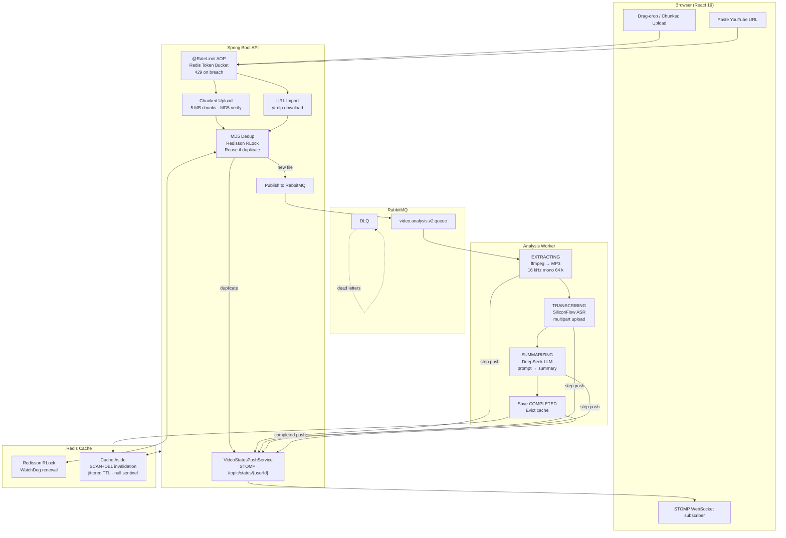

<div align="center">

<h1>VidInsight AI</h1>

<p><strong>Full-stack video analysis platform powered by LLM transcription & summarization</strong></p>

<p>
  <a href="README_CN.md">中文文档</a> ·
  <a href="#quick-start">Quick Start</a> ·
  <a href="#architecture">Architecture</a>
</p>

<p>
  
  
  
  
  
  
  
  
  
</p>

</div>

---

**VidInsight AI** is a full-stack video intelligence platform that extracts transcripts and generates AI summaries from any video — local file or YouTube URL. Built around an async pipeline with real-time progress feedback, it handles the engineering details you'd actually face in production: distributed deduplication, cache consistency, rate limiting, and resumable uploads.

---

## Preview

> **Screenshots placeholder** — add your own screenshots here once the app is running.

| Page | Description |
|------|-------------|
| `[screenshot: login page]` | JWT-based auth, BCrypt passwords |
| `[screenshot: home page]` | Drag-drop upload + URL import |
| `[screenshot: workbench]` | Per-user video task list with live status |
| `[screenshot: analysis modal]` | Real-time EXTRACTING → TRANSCRIBING → SUMMARIZING progress |
| `[screenshot: transcript tab]` | Full ASR transcript |
| `[screenshot: AI summary tab]` | DeepSeek-generated summary |

---

## Core Features

### Resilient Upload
- **Chunked upload** — 5 MB chunks with MD5 verification on merge; survives flaky connections
- **URL import** — yt-dlp downloads YouTube/web videos in the background; STOMP push notifies the frontend when done
- **MD5 deduplication** — if the same file is uploaded twice (same user), the existing ASR + LLM result is reused instantly (Redisson distributed lock prevents race conditions)

### Real-time Pipeline
- **Three-phase progress** — `EXTRACTING → TRANSCRIBING → SUMMARIZING` stages pushed to the browser over WebSocket/STOMP; no polling
- **RabbitMQ async decoupling** — upload API returns in < 100 ms; analysis runs in a separate consumer thread pool with DLQ

### Security & Multi-tenancy
- **Stateless JWT auth** — Spring Security 6 filter chain, HS256, 24 h expiry, BCrypt password hashing
- **Per-user data isolation** — every DB query and cache key is scoped to `userId`; MD5 dedup never leaks results across users

### Redis Engineering
- **Cache Aside** — full write-path invalidation via `SCAN + DEL` (not `KEYS`); null-sentinel for penetration; jittered TTL for avalanche prevention; Redisson RLock with WatchDog for hot-key breakdown
- **Token-bucket rate limiting** — Redis Lua script, `@RateLimit` AOP annotation, per-user and per-IP dimensions, `HTTP 429` on breach

---

## Tech Stack

| Layer | Technologies |
|-------|-------------|
| **Backend** | Spring Boot 3.5 · Java 21 · MyBatis-Plus · Spring Security 6 · jjwt 0.12 |
| **Frontend** | React 19 · TypeScript · Ant Design · Vite · @stomp/stompjs |
| **Database** | MySQL 8 |
| **Cache / Lock** | Redis · Lettuce · Redisson RLock |
| **Messaging** | RabbitMQ (DLQ + idempotent consumer) |
| **AI** | SiliconFlow ASR (`TeleAI/TeleSpeechASR`) · DeepSeek (`DeepSeek-V4-Flash`) |
| **Media tools** | ffmpeg (audio extraction) · yt-dlp (video download) |

---

## Architecture



---

## Development Environment

| Component | Version | Notes |
|-----------|---------|-------|
| **JDK** | 21 | Required for Spring Boot 3.5 virtual threads |
| **Node** | 18 + | Frontend build |
| **MySQL** | 8.x | Docker image `mysql:8.4` |
| **Redis** | 7.x | Docker image `redis:7-alpine` |
| **RabbitMQ** | 3.x | Docker image `rabbitmq:3-management` |
| **ffmpeg** | Latest | Must be in PATH or set via `FFMPEG_PATH` env var |
| **yt-dlp** | Latest | Must be in PATH or set via `YT_DLP_PATH` env var; update regularly |
| **SiliconFlow** | — | Free tier available; set `SILICONFLOW_API_KEY` |

---

## Quick Start

### 1. Start middleware (Docker Compose)

```bash
# From the project root — starts MySQL, Redis, RabbitMQ
docker-compose up -d
```

### 2. Configure environment variables

Set the following as user-level environment variables (no need to touch `application.properties`):

```bash
# Required
SILICONFLOW_API_KEY=sk-your-key-here

# Required if ffmpeg/yt-dlp are not on your PATH
FFMPEG_PATH=C:/path/to/ffmpeg.exe
YT_DLP_PATH=C:/path/to/yt-dlp.exe
YT_DLP_FFMPEG_LOCATION=C:/path/to/ffmpeg-dir
```

On Windows (PowerShell):
```powershell
[System.Environment]::SetEnvironmentVariable("SILICONFLOW_API_KEY", "sk-...", "User")
[System.Environment]::SetEnvironmentVariable("FFMPEG_PATH", "C:\ffmpeg\bin\ffmpeg.exe", "User")
[System.Environment]::SetEnvironmentVariable("YT_DLP_PATH", "C:\yt-dlp\yt-dlp.exe", "User")
```
> Restart your IDE after setting env vars so the JVM picks them up.

### 3. Run the backend

```bash
cd video-insight-backend
./mvnw spring-boot:run
# Ready when you see: Started VideoInsightBackendApplication in X.XXX seconds
```

### 4. Run the frontend

```bash
cd video-insight-frontend
npm install
npm run dev
# Open http://localhost:5173
```

---

## Project Structure

```
VidInsight-AI/
├── video-insight-backend/          # Spring Boot 3.5
│   └── src/main/java/com/videoinsight/backend/
│       ├── config/                 # Redis, RabbitMQ, Security, WebSocket config
│       ├── controller/             # REST API endpoints
│       ├── service/impl/           # Business logic (upload, import, analysis, cache)
│       ├── websocket/              # STOMP push service
│       ├── ratelimit/              # @RateLimit AOP + Redis Lua
│       └── security/               # JWT filter chain
└── video-insight-frontend/         # React 19 + TypeScript
    └── src/
        ├── App.tsx                 # Main UI (workbench, upload, analysis modal)
        ├── Auth.tsx                # Login / register
        └── api.ts                  # Typed API client
```

---

## Resume Highlights

> Below is an accurate project description you can adapt for your resume (all points correspond to real code):

**VidInsight AI** — Full-stack video analysis platform with LLM-powered transcription and summarization

- **Stack**: Spring Boot 3.5 / Java 21 / MyBatis-Plus / React 19 / MySQL 8 / Redis / RabbitMQ
- **Auth & isolation**: Spring Security 6 stateless JWT (HS256, BCrypt), per-user video ownership at every endpoint; MD5 dedup scoped per-user to prevent cross-tenant data leaks
- **Caching**: Redis Cache Aside with full write-path invalidation (per-user list keys evicted via `SCAN`, not `KEYS`); null-sentinel for penetration; jittered TTL for avalanche; Redisson RLock + WatchDog + double-check for hot-key breakdown
- **Async pipeline**: RabbitMQ two-phase workflow (import → analysis) with DLQ + idempotent consumer; startup runner resets orphaned rows
- **Realtime**: WebSocket/STOMP replaces 2.4 s polling; three-phase analysis progress (`EXTRACTING → TRANSCRIBING → SUMMARIZING`) streamed per-video
- **Rate limiting**: token-bucket via Redis Lua, `@RateLimit` AOP annotation, per-user and per-IP, HTTP 429
- **Chunked upload**: 5 MB chunks, resumable, MD5 verified on merge; distributed lock deduplicates concurrent identical uploads

---

## Contributing

PRs and issues are welcome. If this project helped you, a ⭐ is appreciated.

---

*© 2026 VidInsight AI · MIT License*
