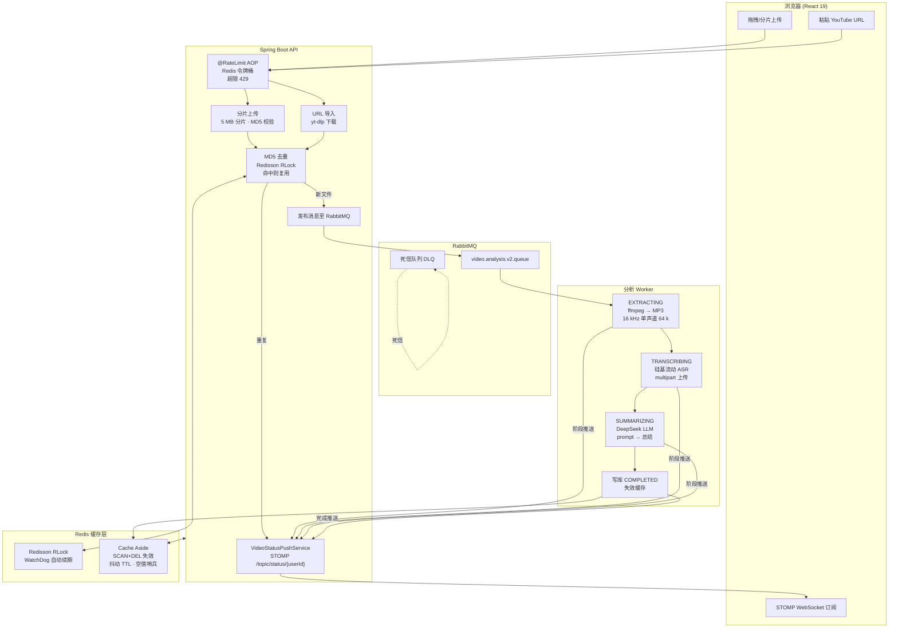

<div align="center">

<h1>VidInsight AI</h1>

<p><strong>基于大模型的视频转写与智能总结全栈平台</strong></p>

<p>
  <a href="README.md">English</a> ·
  <a href="#快速启动">快速启动</a> ·
  <a href="#系统架构">系统架构</a>
</p>

<p>
  
  
  
  
  
  
  
  
  
</p>

</div>

---

**VidInsight AI** 是一个全栈视频智能分析平台，支持本地上传或 YouTube URL 导入，自动提取字幕并生成 AI 总结。系统基于异步管道架构，通过 WebSocket/STOMP 实时推送分析进度，工程上覆盖了生产级常见挑战：分布式去重、缓存一致性、限流防护、断点续传。

---

## 项目预览

### 演示
完整流程：粘贴 YouTube 链接 → 三阶段实时进度 → AI 摘要输出。


### 首页
营销主页 — 登录 / 注册入口，JWT 鉴权。


### 上传页面
拖拽上传 + URL 导入（YouTube 等平台）。


### 工作台
按用户隔离的视频任务列表，实时状态更新与进度反馈。


### 详情弹窗 · 视频
内嵌原视频，方便查看结果时左右对照。


### 详情弹窗 · 字幕
SiliconFlow（SenseVoiceSmall）生成的 ASR 完整字幕。


### 详情弹窗 · AI 总结
DeepSeek-V4-Flash 生成的结构化总结。


---

## 核心功能

### 稳定上传
- **分片断点续传** — 5 MB 分片，合并时 MD5 校验，弱网环境依然稳定
- **URL 导入** — yt-dlp 后台下载 YouTube 等平台视频，完成后 STOMP 推送通知前端
- **MD5 去重** — 同一用户重复上传同一文件时，直接复用已有 ASR + LLM 结果，Redisson 分布式锁防并发竞争

### 实时分析管道
- **三阶段进度推送** — `EXTRACTING → TRANSCRIBING → SUMMARIZING` 状态通过 WebSocket/STOMP 实时推送到浏览器，无需轮询
- **RabbitMQ 异步解耦** — 上传接口 < 100 ms 返回，分析任务在独立消费者线程池中执行，带 DLQ 兜底

### 安全与多租户
- **无状态 JWT 鉴权** — Spring Security 6 过滤器链，HS256，24 小时有效期，BCrypt 密码哈希
- **用户数据严格隔离** — 所有 DB 查询和缓存 key 均按 `userId` 隔离；MD5 去重不复用其他用户的结果

### Redis 工程化
- **Cache Aside** — 写路径全路径失效，`SCAN + DEL` 清理列表缓存（不用 `KEYS`）；空值哨兵防穿透；TTL 随机抖动防雪崩；Redisson RLock + WatchDog 防击穿
- **令牌桶限流** — Redis Lua 脚本，`@RateLimit` AOP 注解，支持按用户/按 IP 两个维度，超限返回 HTTP 429

---

## 技术栈

| 分层 | 技术 |
|------|------|
| **后端** | Spring Boot 3.5 · Java 21 · MyBatis-Plus · Spring Security 6 · jjwt 0.12 |
| **前端** | React 19 · TypeScript · Ant Design · Vite · @stomp/stompjs |
| **数据库** | MySQL 8 |
| **缓存 / 分布式锁** | Redis · Lettuce · Redisson RLock |
| **消息队列** | RabbitMQ（DLQ + 幂等消费者）|
| **AI 接口** | 硅基流动 ASR（`FunAudioLLM/SenseVoiceSmall`）· DeepSeek（`DeepSeek-V4-Flash`）|
| **媒体工具** | ffmpeg（音频提取）· yt-dlp（视频下载）|

---

## 系统架构



---

## 开发环境

| 组件 | 版本 | 说明 |
|------|------|------|
| **JDK** | 21 | Spring Boot 3.5 要求 |
| **Node** | 18+ | 前端构建 |
| **MySQL** | 8.x | Docker 镜像 `mysql:8.4` |
| **Redis** | 7.x | Docker 镜像 `redis:7-alpine` |
| **RabbitMQ** | 3.x | Docker 镜像 `rabbitmq:3-management` |
| **ffmpeg** | 最新版 | 在 PATH 中或通过 `FFMPEG_PATH` 环境变量指定 |
| **yt-dlp** | 最新版 | 在 PATH 中或通过 `YT_DLP_PATH` 环境变量指定；建议定期更新 |
| **硅基流动** | — | 有免费额度；需设置 `SILICONFLOW_API_KEY` |

---

## 快速启动

### 1. 启动中间件（Docker Compose）

```bash
# 在项目根目录执行，一键启动 MySQL、Redis、RabbitMQ
docker-compose up -d
```

### 2. 配置环境变量

推荐设置用户级环境变量（无需修改 `application.properties`，不影响其他开发者）：

```bash
# 必填
SILICONFLOW_API_KEY=sk-你的密钥

# 如果 ffmpeg / yt-dlp 不在 PATH 中则必填
FFMPEG_PATH=C:/path/to/ffmpeg.exe
YT_DLP_PATH=C:/path/to/yt-dlp.exe
YT_DLP_FFMPEG_LOCATION=C:/path/to/ffmpeg-bin-dir
```

Windows PowerShell 设置方式：
```powershell
[System.Environment]::SetEnvironmentVariable("SILICONFLOW_API_KEY", "sk-...", "User")
[System.Environment]::SetEnvironmentVariable("FFMPEG_PATH", "C:\ffmpeg\bin\ffmpeg.exe", "User")
[System.Environment]::SetEnvironmentVariable("YT_DLP_PATH", "C:\yt-dlp\yt-dlp.exe", "User")
```
> 设置后需重启 IDE，使 JVM 重新读取环境变量。

### 3. 启动后端

```bash
cd video-insight-backend
./mvnw spring-boot:run
# 看到 Started VideoInsightBackendApplication in X.XXX seconds 即表示启动成功
```

### 4. 启动前端

```bash
cd video-insight-frontend
npm install
npm run dev
# 访问 http://localhost:5173
```

---

## 项目结构

```
VidInsight-AI/
├── video-insight-backend/          # Spring Boot 3.5
│   └── src/main/java/com/videoinsight/backend/
│       ├── config/                 # Redis、RabbitMQ、Security、WebSocket 配置
│       ├── controller/             # REST API 接口层
│       ├── service/impl/           # 业务逻辑（上传、导入、分析、缓存）
│       ├── websocket/              # STOMP 推送服务
│       ├── ratelimit/              # @RateLimit AOP + Redis Lua 限流
│       └── security/               # JWT 过滤器链
└── video-insight-frontend/         # React 19 + TypeScript
    └── src/
        ├── App.tsx                 # 主界面（工作台、上传、分析弹窗）
        ├── Auth.tsx                # 登录 / 注册
        └── api.ts                  # 类型化 API 客户端
```

## 贡献与支持

欢迎提 PR 和 Issue。如果这个项目对你有帮助，请给个 ⭐。
