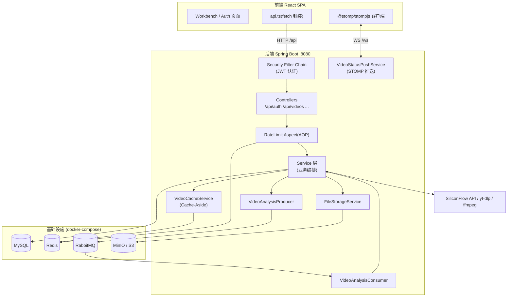
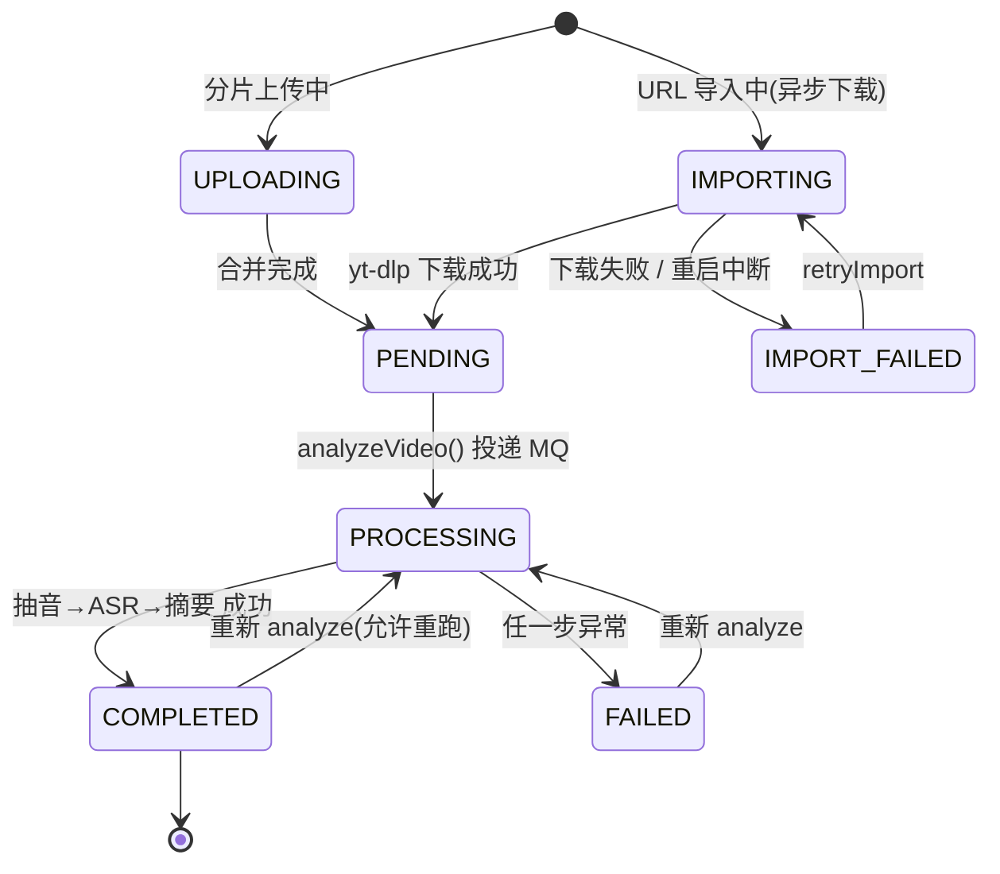
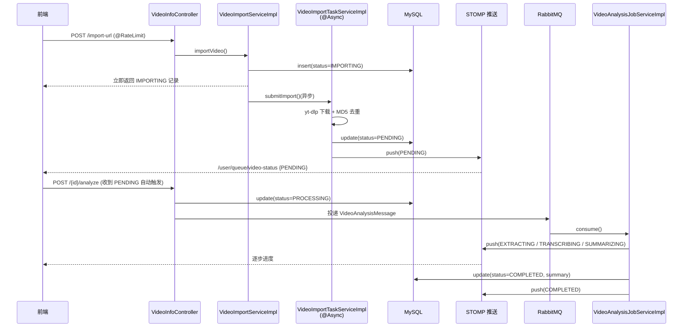
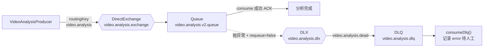
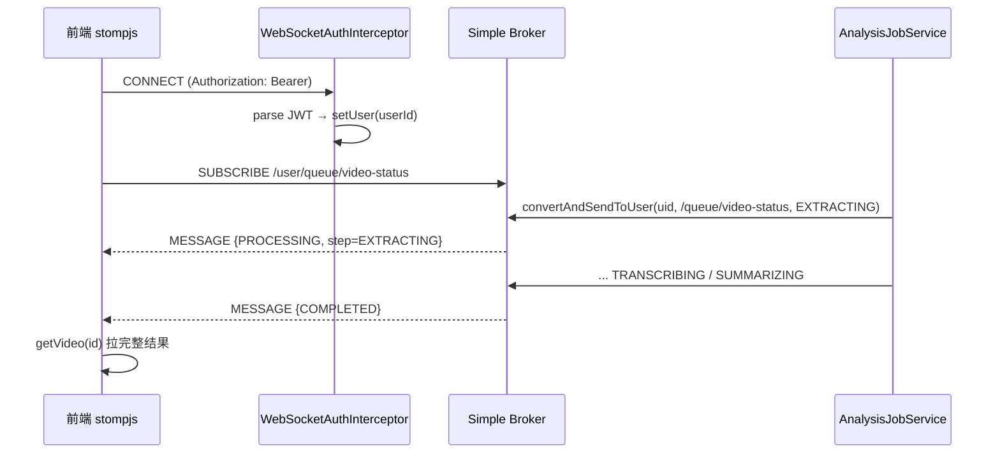
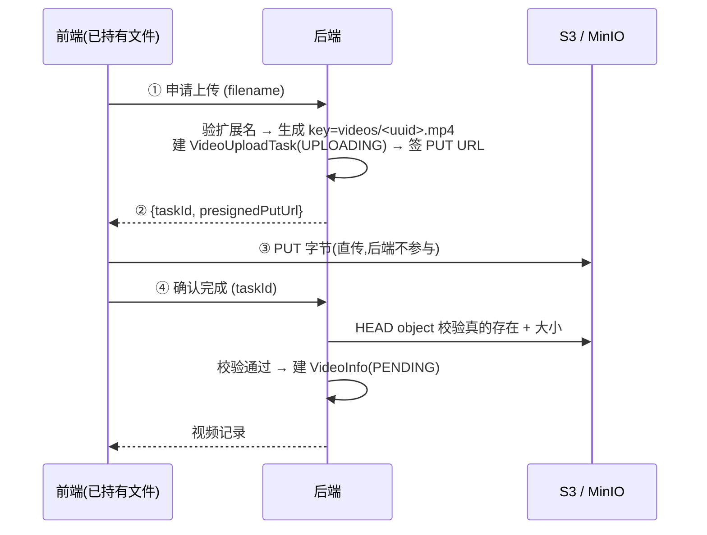
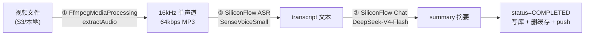

# VidInsight-AI 系统设计文档 / System Design Document

> 本文档面向「把已实现的后端基础设施讲清楚」——逐模块拆解 Redis / RabbitMQ / WebSocket(STOMP) / 安全(JWT) / 存储(S3·MinIO) / 分析流水线 / 前端集成,包含**真实代码片段 + 设计动机 + 流程图**。
> This is an implementation-level design doc: per-module breakdown with real code snippets, the *why* behind each decision, and flow diagrams. Paste-ready for Notion(代码块、表格、mermaid 图均可直接渲染)。

---

## 0. 文档导航 / Module Index

| # | 模块 Module | 关键文件 Key files | 一句话职责 |
|---|---|---|---|
| 1 | 系统总览 Overview | `docker-compose.yml`, `application.properties` | 技术栈、基础设施、统一约定 |
| 2 | 视频生命周期 Lifecycle | `VideoStatus`, `VideoInfoServiceImpl` | 串起所有模块的状态机主流程 |
| 3 | **Redis** | `RedisConfig`, `RedissonConfig`, `RedisVideoCacheServiceImpl`, `ratelimit/*`, `lua/token_bucket.lua` | 缓存 + 分布式锁 + 限流 |
| 4 | **RabbitMQ** | `RabbitMqConfig`, `VideoAnalysisProducer/Consumer`, `VideoAnalysisJobServiceImpl` | 异步分析 + 死信兜底 |
| 5 | **WebSocket / STOMP** | `WebSocketConfig`, `WebSocketAuthInterceptor`, `VideoStatusPushService` | 进度实时推送 |
| 6 | 安全 Security / JWT | `SecurityConfig`, `JwtUtil`, `JwtAuthenticationFilter`, `AuthServiceImpl` | 无状态认证 + 授权 |
| 7 | 存储 Storage | `FileStorageService`, `S3FileStorageServiceImpl`, `LocalFileStorageServiceImpl`, `LocalAccess` | 本地 / S3·MinIO 双实现 |
| 8 | 分析流水线 Pipeline | `FfmpegMediaProcessingServiceImpl`, `SiliconFlow*ServiceImpl` | 抽音→ASR→AI 摘要 |
| 9 | 前端集成 Frontend | `api.ts`, `App.tsx` | 请求封装、分片上传、STOMP 订阅 |
| 10 | 配置参考 Config | `application.properties` | 环境变量速查 |
| 11 | 设计决策 Q&A | — | 面试可背诵的「为什么」 |

---

## 1. 系统总览 / System Overview

### 1.1 技术栈 / Tech Stack

| 层 Layer | 技术 |
|---|---|
| 后端 Backend | Spring Boot 3.5.14 / Java 21 / Maven |
| 持久层 Persistence | MySQL 8.4 + MyBatis-Plus 3.5.9 |
| 缓存/锁/限流 | Redis 7 (Lettuce `RedisTemplate` + Redisson 3.32) |
| 消息队列 MQ | RabbitMQ 3 (management) |
| 实时推送 Realtime | WebSocket + STOMP over SockJS |
| 对象存储 Storage | MinIO / AWS S3 (AWS SDK v2),可切回本地磁盘 |
| 认证 Auth | Spring Security + JWT (jjwt 0.12.6, HS256) |
| AI 能力 | SiliconFlow ASR(`SenseVoiceSmall`) + Chat(`DeepSeek-V4-Flash`) |
| 外部工具 External bin | `yt-dlp`(URL 导入) + `ffmpeg`(抽音) |
| 前端 Frontend | React 19 + Vite + Ant Design 6 + `@stomp/stompjs` |

### 1.2 架构分层 / Layered Architecture



### 1.3 基础设施 / Infrastructure（`docker-compose.yml`）

四个容器,均带 `healthcheck`,数据卷持久化:

| 服务 | 镜像 | 端口 | 用途 |
|---|---|---|---|
| `vidinsight-mysql` | `mysql:8.4` | 3306 | 业务库 `video_insight` |
| `vidinsight-rabbitmq` | `rabbitmq:3-management` | 5672 / 15672 | MQ + 管理台 |
| `vidinsight-redis` | `redis:7-alpine` | 6379 | 缓存/锁/限流(`--appendonly yes` 开 AOF) |
| `vidinsight-minio` | `minio/minio` | 9000 / 9001 | S3 兼容对象存储 + 控制台 |

> 启动顺序:`docker compose up -d` 必须先于后端启动。

### 1.4 全局约定 / Global Conventions

**统一响应体 `ApiResponse<T>`**——所有接口返回 `{code, message, data}`,前端 `request()` 严格依赖这个信封:

```java
public static <T> ApiResponse<T> success(T data) { return new ApiResponse<>(200, "success", data); }
public static <T> ApiResponse<T> fail(Integer code, String message) { return new ApiResponse<>(code, message, null); }
```

**全局异常处理 `GlobalExceptionHandler`**——把异常翻译成统一信封。注意一个**刻意的例外**:限流返回真正的 HTTP 429(而非 200+body),方便反向代理/监控/客户端退避识别:

```java
@ResponseStatus(HttpStatus.TOO_MANY_REQUESTS)          // ← 唯一打破 "业务错误走 HTTP 200" 约定的地方
@ExceptionHandler(RateLimitExceededException.class)
public ApiResponse<Void> handleRateLimit(RateLimitExceededException e) {
    return ApiResponse.fail(429, e.getMessage());
}

@ExceptionHandler(BusinessException.class)             // 业务错误 → HTTP 200 + body.code
public ApiResponse<Void> handleBusinessException(BusinessException e) {
    return ApiResponse.fail(e.getCode(), e.getMessage());
}
```

---

## 2. 视频生命周期 / Video Lifecycle（贯穿所有模块的主线）

### 2.1 状态机 / State Machine

`VideoStatus` 枚举驱动整个流程。两段式:**Phase 1 入库(intake)** 和 **Phase 2 分析(analysis)** 在传输与持久化上都解耦。



### 2.2 两段式解耦的动机 / Why two phases

- **Phase 1(入库)= Spring `@Async` 线程池**:文件搬运是 I/O 密集、可在本进程内并发,用 `analysisTaskExecutor`(core=2/max=4/queue=100)。任务只活在内存,**重启即丢**——所以靠 DB 行的瞬态状态 + 启动恢复(见 2.5)兜底。
- **Phase 2(分析)= RabbitMQ 驱动**:ASR/LLM 是慢、贵、可能失败的外部调用,放进 MQ 才能拿到「跨重启重投、削峰、死信兜底」。

### 2.3 三条入库路径 / Three intake paths

| 路径 | 入口 | 异步? | 落库初始状态 |
|---|---|---|---|
| 本地整文件上传 | `POST /api/videos/upload` | 否(同步存储) | `PENDING` |
| 分片上传 | `/api/videos/chunks/{init,upload,complete}` | complete 同步合并 | `PENDING` |
| URL 导入 | `POST /api/videos/import-url` | 是(`@Async` 跑 yt-dlp) | `IMPORTING`→`PENDING` |

### 2.4 端到端时序(以 URL 导入为例) / End-to-end Sequence



### 2.5 启动恢复 / Startup Recovery

`StartupRecoveryRunner`(`ApplicationRunner`)开机把所有 `IMPORTING` 行重置为 `IMPORT_FAILED`——因为 `@Async` 任务在内存,重启丢失但 DB 行还卡在瞬态状态。`PROCESSING` **不**在这里重置,它靠 RabbitMQ 未 ACK 消息重投自愈。

```java
int updated = videoInfoMapper.update(null, new LambdaUpdateWrapper<VideoInfo>()
        .eq(VideoInfo::getVideoStatus, VideoStatus.IMPORTING)
        .set(VideoInfo::getVideoStatus, VideoStatus.IMPORT_FAILED)
        .set(VideoInfo::getSummary, "Import interrupted by service restart")
        .set(VideoInfo::getUpdatedAt, LocalDateTime.now()));
```

---

## 3. Redis 模块 / Redis Module ⭐

Redis 在本项目承担**三个独立职责**:① 业务缓存(Cache-Aside)② 分布式锁 ③ 限流(Lua 令牌桶)。

### 3.1 文件清单 / File Inventory

| 文件 | 职责 |
|---|---|
| `config/RedisConfig.java` | `RedisTemplate` Bean,定制 JSON 序列化 |
| `config/RedissonConfig.java` | `RedissonClient` Bean(单机模式) |
| `service/VideoCacheService.java` | 缓存接口(三态返回语义) |
| `service/impl/RedisVideoCacheServiceImpl.java` | 缓存实现(穿透/击穿/雪崩三防 + SCAN 清理) |
| `ratelimit/RateLimit.java` | `@RateLimit` 注解 |
| `ratelimit/RateLimitAspect.java` | AOP 切面,执行 Lua 脚本 |
| `ratelimit/KeyStrategy.java` | 分桶维度 USER / IP |
| `ratelimit/RateLimitExceededException.java` | 超限异常 → HTTP 429 |
| `resources/lua/token_bucket.lua` | 令牌桶原子脚本 |
| `service/impl/HealthServiceImpl.java` | Redis / Redisson 健康探针 |

### 3.2 为什么两套客户端并存 / Lettuce + Redisson coexist

```java
// RedissonConfig 类注释原文:
// RedisTemplate(Lettuce) → 缓存读写(Cache Aside)
// RedissonClient        → 分布式锁(RLock,自带 WatchDog 续期)
// 两套连接池各管各的,互不干扰。
```

- **Lettuce(`RedisTemplate`)** 跟 Spring Data Redis 自动配置走,做缓存的普通读写最顺手。
- **Redisson** 提供工业级 `RLock`:可重入、自带 **WatchDog 自动续期**(持锁线程没跑完就一直续,避免锁提前过期),比自己用 `SETNX + Lua` 手搓锁稳。

### 3.3 序列化配置 / `RedisConfig`

key 用 `String`,value 用 JSON。难点是**多态/泛型反序列化**——开启 `activateDefaultTyping` 把类型信息写进 JSON,这样 `PageResult<VideoInfo>` 这种泛型也能正确还原:

```java
@Bean
public RedisTemplate<String, Object> redisTemplate(RedisConnectionFactory cf) {
    RedisTemplate<String, Object> t = new RedisTemplate<>();
    t.setConnectionFactory(cf);
    StringRedisSerializer keySer = new StringRedisSerializer();
    GenericJackson2JsonRedisSerializer valSer =
            new GenericJackson2JsonRedisSerializer(buildObjectMapper());
    t.setKeySerializer(keySer);  t.setHashKeySerializer(keySer);
    t.setValueSerializer(valSer); t.setHashValueSerializer(valSer);
    t.afterPropertiesSet();
    return t;
}

private ObjectMapper buildObjectMapper() {
    ObjectMapper m = new ObjectMapper();
    m.registerModule(new JavaTimeModule());                 // 支持 LocalDateTime
    m.setVisibility(PropertyAccessor.ALL, JsonAutoDetect.Visibility.ANY);
    m.activateDefaultTyping(                                 // 把 @class 写进 JSON,泛型才能还原
            BasicPolymorphicTypeValidator.builder().allowIfBaseType(Object.class).build(),
            ObjectMapper.DefaultTyping.NON_FINAL);
    return m;
}
```

### 3.4 Redisson 配置 / `RedissonConfig`

单机模式,地址/库/超时全走 `spring.data.redis.*`(与 Lettuce 共享同一份配置),`destroyMethod = "shutdown"` 保证优雅关闭:

```java
@Bean(destroyMethod = "shutdown")
public RedissonClient redissonClient() {
    Config config = new Config();
    var single = config.useSingleServer()
            .setAddress("redis://" + host + ":" + port)
            .setDatabase(database)
            .setConnectTimeout((int) timeout.toMillis())
            .setTimeout((int) timeout.toMillis());
    if (StringUtils.hasText(password)) single.setPassword(password);
    return Redisson.create(config);
}
```

### 3.5 缓存设计:Cache-Aside + 三大问题 / Caching

#### 三态返回语义 / Three-state return

接口 `getDetail(id)` 用「返回值本身的三种形态」区分三种缓存状态——避免调用方误把「命中空值」当成「未命中」去回源:

```java
// null            → 缓存未命中,需要回源 DB
// Optional.empty()→ 命中"不存在"哨兵(防穿透),直接返回 null,不要回源
// Optional.of(vi) → 命中真实数据
Optional<VideoInfo> getDetail(Long id);
```

#### 防穿透 / Cache penetration —— 空值哨兵

DB 里不存在的 id 也写一个短 TTL 的哨兵 `__NULL__`,挡住「反复查不存在的 id 把每次都打到 DB」的攻击:

```java
private static final String NULL_SENTINEL = "__NULL__";
// 命中哨兵:
if (NULL_SENTINEL.equals(cached)) return Optional.empty();
// 回源发现 DB 也没有:
void markDetailMissing(Long id);   // TTL 2min+jitter,比真实数据短,过期后允许重试
```

#### 防击穿 / Cache breakdown —— 分布式锁 + 双重检查

热点 key 过期瞬间,大量请求同时回源会压垮 DB。`getDetailOrLoad` 用 Redisson 锁让**同一时刻只有一个线程回源**,其余等结果;拿不到锁则**降级直读 DB**(fail-open,不把请求拖死):

```java
public VideoInfo getDetailOrLoad(Long id, Supplier<VideoInfo> dbLoader) {
    Optional<VideoInfo> cached = getDetail(id);            // 1) 先查缓存
    if (cached != null) return cached.orElse(null);

    RLock lock = redissonClient.getLock(DETAIL_LOCK_PREFIX + id);  // 2) miss → 抢锁
    boolean acquired = false;
    try {
        acquired = lock.tryLock(LOAD_LOCK_WAIT_SECONDS, TimeUnit.SECONDS);  // 等锁最多 5s
        if (!acquired) return dbLoader.get();             // 拿不到锁 → 降级直读 DB

        cached = getDetail(id);                            // 3) 双重检查:等锁期间别人可能已写好
        if (cached != null) return cached.orElse(null);

        VideoInfo db = dbLoader.get();                     // 4) 真正回源
        if (db != null) setDetail(id, db); else markDetailMissing(id);
        return db;
    } catch (InterruptedException e) {
        Thread.currentThread().interrupt();
        return dbLoader.get();
    } finally {
        if (acquired && lock.isHeldByCurrentThread()) lock.unlock();
    }
}
```

#### 防雪崩 / Cache avalanche —— TTL 抖动

所有 TTL = 基础值 + `[0, jitter]` 随机秒,避免大批 key 在同一时刻集体过期:

```java
private Duration jitter(Duration base, int jitterSeconds) {
    return base.plusSeconds(ThreadLocalRandom.current().nextInt(jitterSeconds + 1));
}
// detail: 10min + [0,120s]   list: 60s + [0,10s]   missing: 2min + [0,30s]
```

#### 列表缓存失效 —— 用 SCAN 不用 KEYS

任何改变某用户列表内容的写操作(新增/删除/状态变化)都要 `evictUserLists(userId)`,否则前端会读到脏数据(例如「DB 已删 → 列表仍在 → 重复删 404」)。清理用游标式 `SCAN`,**绝不用 `KEYS`**(后者在大数据集上阻塞整个 Redis):

```java
public void evictUserLists(Long userId) {
    ScanOptions opt = ScanOptions.scanOptions()
            .match(LIST_KEY_PREFIX + userId + ":*").count(100).build();
    List<String> matched = new ArrayList<>();
    try (Cursor<String> cursor = redisTemplate.scan(opt)) {
        while (cursor.hasNext()) matched.add(cursor.next());
    }
    if (!matched.isEmpty()) redisTemplate.delete(matched);
}
```

> **缓存一致性策略**:写后**删缓存**(不是更新缓存),下次读再回源重建。删除时机散落在 `VideoInfoServiceImpl`(create/upload/delete/analyze)、`VideoAnalysisJobServiceImpl`(completed/failed)、`VideoImportTaskServiceImpl` 等所有写路径。

> **容错**:所有缓存读写都 `try/catch` 包住,失败只 `log.warn` 然后回退 DB——**Redis 挂了业务不能停**。

### 3.6 分布式锁的另一个用途:MD5 去重串行化

相同文件可能被两个请求并发上传/导入,若各自「查 `findCompletedByMd5` → 没有 → INSERT 一行」,就会出现两条同 MD5 记录都跑一遍昂贵的 ASR/LLM。用 `vidinsight:lock:upload:md5:{md5}` 把「查 + 决策 + 建」串行化(见 `VideoUploadTaskServiceImpl.upsertWithMd5Lock` / `VideoImportTaskServiceImpl.reuseIfDuplicate`):

```java
RLock lock = redissonClient.getLock(MD5_LOCK_PREFIX + md5);
if (lock.tryLock(MD5_LOCK_WAIT_SECONDS, TimeUnit.SECONDS)) {
    try {
        VideoInfo existing = videoInfoMapper.findCompletedByMd5AndUser(md5, userId);  // 按用户隔离
        if (existing != null) { /* 复用结果,不重跑 */ }
        else { /* 创建新记录 */ }
    } finally { if (lock.isHeldByCurrentThread()) lock.unlock(); }
}
```

> 去重**按用户隔离**(`findCompletedByMd5AndUser`):不能让用户 A 上传相同视频直接拿到用户 B 的私有 transcript/summary。

### 3.7 限流:Redis + Lua 令牌桶 / Rate Limiting

#### `@RateLimit` 注解

声明式标在 Controller 方法上:

```java
@RateLimit(key = "video.import", capacity = 5, refillPerMinute = 5)              // 默认按 USER
@RateLimit(key = "auth.login", capacity = 5, refillPerMinute = 5, strategy = KeyStrategy.IP)
```

| 参数 | 含义 |
|---|---|
| `key` | 桶名(逻辑分组)。同 key 多端点共享一个桶 |
| `capacity` | 桶容量 = 允许的突发量 |
| `refillPerMinute` | 每分钟补充令牌数,决定长期速率 |
| `strategy` | `USER`(按登录用户 id)/ `IP`(按客户端 IP,用于登录注册防爆破) |

#### 切面 `RateLimitAspect`

把脚本和参数交给 Redis 原子执行。**关键容错决策:fail-open**——Redis 挂了不应连业务接口一起停:

```java
@Around("@annotation(rateLimit)")
public Object around(ProceedingJoinPoint pjp, RateLimit rateLimit) throws Throwable {
    String bucketKey = buildKey(rateLimit);                     // ratelimit:{key}:user:{id} 或 :ip:{ip}
    double refillPerSecond = rateLimit.refillPerMinute() / 60.0;
    Long allowed;
    try {
        allowed = redisTemplate.execute(tokenBucketScript,
                Collections.singletonList(bucketKey),
                String.valueOf(rateLimit.capacity()),
                String.valueOf(refillPerSecond),
                String.valueOf(System.currentTimeMillis()));
    } catch (Exception e) {
        log.warn("Rate limit check failed, allowing through. Cause: {}", e.getMessage());
        return pjp.proceed();                                   // ← fail-open(NG 项目取舍;银行类应 fail-closed)
    }
    if (allowed == null || allowed == 0L)
        throw new RateLimitExceededException(bucketKey, "too many requests, please slow down");
    return pjp.proceed();
}
```

客户端 IP 解析考虑了反代:`X-Forwarded-For` 首段 → `X-Real-IP` → `getRemoteAddr()`(并注释提醒「头部攻击者可控,公网只信任已知反代」)。

#### Lua 脚本 `token_bucket.lua`(逐行讲解)

为什么用 Lua:**Redis 单线程执行整段脚本,保证「读→算→写」原子**,等价于把 read-modify-write 包进事务,但能中途 `if/else`。算法是「懒补令牌」(lazy refill)——不开后台定时器,每次进来按「距上次访问过了多少秒」补:

```lua
local capacity = tonumber(ARGV[1])      -- 桶容量
local rate     = tonumber(ARGV[2])      -- 每秒补充率(小数)
local now      = tonumber(ARGV[3])      -- 当前毫秒

local data   = redis.call('HMGET', KEYS[1], 'tokens', 'ts')
local tokens = tonumber(data[1])
local ts     = tonumber(data[2])
if tokens == nil then tokens = capacity; ts = now end   -- 首次:满桶

-- 懒补:过了多少秒就补多少令牌(不超容量),tokens 用浮点(否则 0.083/s 永远凑不齐 1)
local elapsed = math.max(0, now - ts) / 1000
tokens = math.min(capacity, tokens + elapsed * rate)

if tokens >= 1 then
    tokens = tokens - 1
    redis.call('HMSET', KEYS[1], 'tokens', tokens, 'ts', now)
    redis.call('EXPIRE', KEYS[1], 120)                  -- 2min 没人用就回收,防僵尸 key
    return 1                                             -- 放行
else
    redis.call('HMSET', KEYS[1], 'tokens', tokens, 'ts', now)  -- 拒绝也写回 ts
    redis.call('EXPIRE', KEYS[1], 120)
    return 0                                             -- 拒绝
end
```

#### 当前限流策略表 / Active limits

| 端点 | key | capacity | refill/min | 维度 |
|---|---|---|---|---|
| 注册 `/api/auth/register` | `auth.register` | 3 | 3 | IP |
| 登录 `/api/auth/login` | `auth.login` | 5 | 5 | IP |
| URL 导入 / 重试 | `video.import` | 5 | 5 | USER |
| 本地上传 | `video.upload` | 10 | 10 | USER |
| 分片 init | `video.chunked.init` | 10 | 10 | USER |
| 提交分析 | `video.analyze` | 5 | 5 | USER |

### 3.8 健康探针 / Health probes

`/api/health/redis` 写一个 30s TTL 的 key 再读回校验往返;`/api/health/redisson` 抢一把临时锁验证锁机制可用。

### 3.9 Redis Key 命名总表 / Key namespace

| Key 模式 | 类型 | 用途 | TTL |
|---|---|---|---|
| `vidinsight:video:detail:{id}` | String(JSON / `__NULL__`) | 视频详情缓存 | 10min+jitter / 哨兵 2min+jitter |
| `vidinsight:video:list:user:{uid}:{page}:{size}` | String(JSON) | 分页列表缓存 | 60s+jitter |
| `vidinsight:lock:video:detail:{id}` | Redisson RLock | 回源互斥(防击穿) | WatchDog |
| `vidinsight:lock:upload:md5:{md5}` | Redisson RLock | 去重串行化 | WatchDog |
| `vidinsight:ratelimit:{key}:user:{uid}` / `:ip:{ip}` | Hash{tokens,ts} | 令牌桶 | 120s |
| `vidinsight:health:ping` / `:redisson:probe` | String / Lock | 健康探针 | 30s / — |

---

## 4. RabbitMQ 模块 / MQ Module ⭐

### 4.1 文件清单 / File Inventory

| 文件 | 职责 |
|---|---|
| `config/RabbitMqConfig.java` | 声明 exchange / queue / binding / DLX / DLQ + 容器工厂 |
| `config/RabbitMqProperties.java` | `app.rabbitmq.*` 配置绑定 |
| `mq/VideoAnalysisProducer.java` | 发送分析消息 |
| `mq/VideoAnalysisConsumer.java` | 消费 + 死信消费 |
| `model/message/VideoAnalysisMessage.java` | 消息体(只含 `videoId`) |
| `service/impl/VideoAnalysisJobServiceImpl.java` | 真正的分析编排(被 consumer 调用) |

### 4.2 拓扑 / Topology



### 4.3 配置 `RabbitMqConfig`(含一个易踩的坑)

主队列声明时绑定 DLX 参数;消费失败且不重投 → 自动路由到死信队列:

```java
@Bean
public Queue videoAnalysisQueue() {
    return QueueBuilder.durable(props.getVideoAnalysisQueue())
            .withArgument("x-dead-letter-exchange", props.getDlx())
            .withArgument("x-dead-letter-routing-key", props.getDlqRoutingKey())
            .build();
}

@Bean
public SimpleRabbitListenerContainerFactory rabbitListenerContainerFactory(
        SimpleRabbitListenerContainerFactoryConfigurer configurer, ConnectionFactory cf) {
    SimpleRabbitListenerContainerFactory factory = new SimpleRabbitListenerContainerFactory();
    configurer.configure(factory, cf);
    factory.setDefaultRequeueRejected(false);   // 抛异常不重新入队 → 直接进 DLQ,不死循环
    return factory;
}
```

> ⚠️ **队列参数不可变陷阱**:若 RabbitMQ 里已存在同名队列(参数不同),Broker 会**拒绝重新声明**导致启动失败。改了队列参数必须先在管理台删旧队列。项目里队列名是 `video.analysis.v2.queue`(带 `v2`)就是为此——加 DLX 参数后换了新名,绕开旧队列冲突。

消息用 `Jackson2JsonMessageConverter` 序列化(JSON,可读、跨语言友好)。

### 4.4 生产者 `VideoAnalysisProducer`

只发一个 `videoId`(瘦消息体,数据回 DB 查,避免消息过期失真):

```java
public void send(Long videoId) {
    rabbitTemplate.convertAndSend(props.getVideoAnalysisExchange(),
            props.getVideoAnalysisRoutingKey(), new VideoAnalysisMessage(videoId));
}
```

### 4.5 消费者 `VideoAnalysisConsumer` —— ACK/NACK 契约

「成功就正常返回(自动 ACK),失败就抛异常(进 DLQ)」:

```java
@RabbitListener(queues = "${app.rabbitmq.video-analysis-queue}")
public void consume(VideoAnalysisMessage message) {
    if (message == null || message.getVideoId() == null) return;   // 脏消息直接丢弃
    videoAnalysisJobService.executeAnalysis(message.getVideoId());
    // 正常返回 → 自动 ACK,消息删除
    // 抛异常 → requeue-rejected=false → 路由到 DLQ,不循环重投
}

@RabbitListener(queues = "${app.rabbitmq.dlq}")
public void consumeDlq(VideoAnalysisMessage message) {       // 死信兜底:记录待人工
    log.error("Dead letter received — videoId={} 已进入死信队列,需人工检查。", ...);
}
```

### 4.6 幂等 / Idempotency

MQ 至少投递一次(at-least-once),可能重投。`executeAnalysis` 开头做幂等检查:已 `COMPLETED` 的直接跳过,不重跑昂贵 AI:

```java
public void executeAnalysis(Long videoId) {
    VideoInfo videoInfo = videoInfoMapper.selectById(videoId);
    if (videoInfo == null) return;
    if (videoInfo.getVideoStatus() == VideoStatus.COMPLETED) {     // ← 幂等:容忍重投
        log.info("Video {} already completed, skipping duplicate MQ delivery.", videoId);
        return;
    }
    // EXTRACTING → TRANSCRIBING → SUMMARIZING → COMPLETED,每步 push 进度
}
```

### 4.7 关键消费配置 / Listener config

```properties
spring.rabbitmq.listener.simple.prefetch=1                       # 一次只取一条,慢任务公平分配
spring.rabbitmq.listener.simple.default-requeue-rejected=false   # 配合 DLQ 契约
```

`prefetch=1`:分析任务很慢,设 1 保证一个消费者一次只处理一条,避免一个实例囤一堆消息而别的实例空闲。

### 4.8 为什么 Phase 2 用 MQ 而不是 `@Async`

| | `@Async`(Phase 1 用) | RabbitMQ(Phase 2 用) |
|---|---|---|
| 跨重启 | ❌ 内存任务丢失 | ✅ 未 ACK 消息重投自愈 |
| 削峰 | ❌ 线程池满即拒 | ✅ 队列堆积缓冲 |
| 失败兜底 | ❌ 自己 try/catch | ✅ DLQ + 人工补偿 |
| 适用 | 快、可丢、I/O 搬运 | 慢、贵、不可丢、外部依赖 |

---

## 5. WebSocket / STOMP 模块 ⭐

实时把分析进度(EXTRACTING/TRANSCRIBING/SUMMARIZING/COMPLETED)推给**对应用户**,前端不必傻轮询。

### 5.1 文件清单 / File Inventory

| 文件 | 职责 |
|---|---|
| `config/WebSocketConfig.java` | STOMP broker + endpoint + 入站拦截器注册 |
| `websocket/WebSocketAuthInterceptor.java` | CONNECT 帧 JWT 鉴权 |
| `websocket/VideoStatusPushService.java` | 点对点推送封装 |
| `websocket/VideoStatusPush.java` | 推送消息体(record) |
| 前端 `App.tsx` | `@stomp/stompjs` 订阅 |

### 5.2 协议栈 / Protocol stack

`STOMP`(应用层消息语义,带订阅/destination)运行在 `WebSocket` 之上,服务端再用 `SockJS` 兜底(浏览器不支持 WS 时降级)。Spring 内置 **simple broker** 做内存级消息分发,无需外部 broker。

### 5.3 `WebSocketConfig`

```java
@Configuration @EnableWebSocketMessageBroker
public class WebSocketConfig implements WebSocketMessageBrokerConfigurer {

    @Override
    public void configureMessageBroker(MessageBrokerRegistry registry) {
        registry.enableSimpleBroker("/queue");          // 内存 broker,推送目的地前缀
        registry.setUserDestinationPrefix("/user");     // 点对点:/user/{userId}/queue/...
        registry.setApplicationDestinationPrefixes("/app");  // 客户端→服务端的前缀(本项目未用)
    }

    @Override
    public void registerStompEndpoints(StompEndpointRegistry registry) {
        registry.addEndpoint("/ws").setAllowedOriginPatterns("*").withSockJS();  // 握手端点
    }

    @Override
    public void configureClientInboundChannel(ChannelRegistration registration) {
        registration.interceptors(webSocketAuthInterceptor);   // 挂鉴权拦截器
    }
}
```

### 5.4 鉴权 `WebSocketAuthInterceptor`

WebSocket 握手不像 HTTP 每次带 header,所以在 **STOMP CONNECT 帧** 里取 `Authorization: Bearer xxx` 校验 JWT,通过则把 `Principal` 绑到 session(后续点对点推送靠它路由):

```java
@Override
public Message<?> preSend(Message<?> message, MessageChannel channel) {
    StompHeaderAccessor accessor = MessageHeaderAccessor.getAccessor(message, StompHeaderAccessor.class);
    if (accessor == null || !StompCommand.CONNECT.equals(accessor.getCommand())) return message;  // 只拦 CONNECT

    String raw = accessor.getFirstNativeHeader("Authorization");
    if (!StringUtils.hasText(raw) || !raw.startsWith("Bearer "))
        throw new MessageDeliveryException(message, "missing or malformed Authorization header");
    try {
        Claims claims = jwtUtil.parse(raw.substring(7));
        Long userId = jwtUtil.extractUserId(claims);
        Principal principal = userId::toString;                  // Principal.getName() = userId
        accessor.setUser(new UsernamePasswordAuthenticationToken(principal, null, null));
    } catch (JwtException e) {
        throw new MessageDeliveryException(message, "invalid JWT: " + e.getMessage());
    }
    return message;
}
```

### 5.5 点对点推送 `VideoStatusPushService`

`convertAndSendToUser(userId, "/queue/video-status", push)` → 实际目的地是 `/user/{userId}/queue/video-status`,Spring 据 Principal 只投给该用户的 session。推送失败只 `warn`(用户可能没在线,不能因此让分析流程崩):

```java
public void push(Long userId, VideoStatusPush push) {
    try {
        messagingTemplate.convertAndSendToUser(userId.toString(), "/queue/video-status", push);
    } catch (Exception e) {
        log.warn("WebSocket push failed for userId={}, videoId={}: {}", userId, push.videoId(), e.getMessage());
    }
}
```

消息体:

```java
public record VideoStatusPush(Long videoId, String videoStatus, String audioUrl, String step) {}
```

### 5.6 推送时机 / Push points

`VideoAnalysisJobServiceImpl` 在每步推进度,终态推结果;`VideoImportTaskServiceImpl` 在导入完成/失败时推:

```java
pushStep(videoInfo, "EXTRACTING");     // status=PROCESSING, step=EXTRACTING
pushStep(videoInfo, "TRANSCRIBING");
pushStep(videoInfo, "SUMMARIZING");
// 完成:
videoStatusPushService.push(userId, new VideoStatusPush(id, "COMPLETED", publicAudioUrl, null));
```

### 5.7 前端订阅 / Frontend client(`App.tsx`)

用原生 WebSocket 直连 SockJS 暴露的 `/ws/websocket` 子路径,CONNECT 帧带 token,订阅自己的 `/user/queue/video-status`:

```ts
const protocol = window.location.protocol === 'https:' ? 'wss' : 'ws';
const client = new Client({
  brokerURL: `${protocol}://${window.location.host}/ws/websocket`,
  connectHeaders: { Authorization: `Bearer ${token}` },
  reconnectDelay: 5000,                                  // 断线 5s 自动重连
});

client.onConnect = () => {
  client.subscribe('/user/queue/video-status', (frame) => {
    const push = JSON.parse(frame.body);
    if (push.videoStatus === 'PENDING') {                // 导入完成 → 自动触发分析
      setTimeout(() => void handleStartAnalysis({ id: push.videoId }), 0);
    } else if (push.videoStatus === 'PROCESSING' && push.step) {
      setProcessingSteps((p) => ({ ...p, [push.videoId]: push.step }));  // 显示进度阶段
    } else if (['COMPLETED','FAILED','IMPORT_FAILED'].includes(push.videoStatus)) {
      void getVideo(push.videoId).then(updateLocalState); // 终态 → 拉完整记录
    }
  });
};
client.activate();
```

### 5.8 推送 vs 轮询 / Push + polling fallback

项目**两条路并存**:STOMP 推送做主通道(实时、省请求);前端对仍处 `IMPORTING/PROCESSING` 的视频每 2.4s 轮询 `getVideo(id)` 兜底(WS 断连/丢帧时仍能收敛到终态)。

### 5.9 时序 / Sequence



---

## 6. 安全 / Security & JWT 模块

无状态 JWT 认证,纯 API 后端(无 session、无 CSRF)。

### 6.1 文件清单 / File Inventory

| 文件 | 职责 |
|---|---|
| `config/SecurityConfig.java` | Filter chain + 放行规则 + BCrypt |
| `config/JwtProperties.java` | `app.jwt.*`(secret/有效期/issuer) |
| `security/JwtUtil.java` | 签发 / 解析 JWT |
| `security/JwtAuthenticationFilter.java` | 每请求一次解析 Bearer |
| `security/AppUserPrincipal.java` | 写入 SecurityContext 的用户主体(无敏感字段) |
| `security/SecurityUtil.java` | 静态取当前 userId |
| `security/RestAuthEntryPoint.java` | 未认证 → JSON 401(非 HTML 登录页) |
| `service/impl/AuthServiceImpl.java` | 注册 / 登录 / 当前用户 |

### 6.2 `SecurityConfig` —— Filter chain

```java
http.csrf(disable)                                       // 纯 API,前端自存 JWT,关 CSRF
    .sessionManagement(s -> s.sessionCreationPolicy(STATELESS))  // 无 session
    .cors(c -> {})                                       // 放行 CORS(详见 CorsConfig)
    .authorizeHttpRequests(reg -> reg
        .requestMatchers("/api/auth/register","/api/auth/login","/api/health/**",
                         "/v3/api-docs/**","/swagger-ui/**","/uploads/**","/ws/**").permitAll()
        .requestMatchers(HttpMethod.OPTIONS, "/**").permitAll()  // preflight 放行
        .anyRequest().authenticated())
    .exceptionHandling(eh -> eh.authenticationEntryPoint(restAuthEntryPoint))  // JSON 401
    .addFilterBefore(jwtAuthenticationFilter, UsernamePasswordAuthenticationFilter.class);
```

### 6.3 `JwtUtil` —— 签发 / 解析

HS256;`Keys.hmacShaKeyFor` 要求密钥 ≥ 32 字节;解析强制校验 `issuer` 与签名/过期:

```java
public String issue(Long userId, String email) {
    Date now = new Date(), exp = new Date(now.getTime() + Duration.ofHours(props.getExpirationHours()).toMillis());
    return Jwts.builder().issuer(props.getIssuer()).subject(String.valueOf(userId))
            .claim("email", email).issuedAt(now).expiration(exp)
            .signWith(signingKey(), Jwts.SIG.HS256).compact();
}

public Claims parse(String token) {                      // 失败抛 JwtException(过期/篡改)
    return Jwts.parser().verifyWith(signingKey()).requireIssuer(props.getIssuer())
            .build().parseSignedClaims(token).getPayload();
}
```

### 6.4 `JwtAuthenticationFilter` —— 关键安全决策

**「无 token」与「token 无效」必须区别对待**:无 token 放行(公开接口允许匿名);**有 token 但解析失败直接 401**,绝不当匿名静默通过(否则客户端以为已登录、实则所有操作拿不到 userId):

```java
String header = request.getHeader(AUTHORIZATION);
if (!StringUtils.hasText(header) || !header.startsWith("Bearer ")) { chain.doFilter(...); return; }  // 无 token → 放行
try {
    Claims claims = jwtUtil.parse(header.substring(7).trim());
    AppUserPrincipal principal = new AppUserPrincipal(jwtUtil.extractUserId(claims), claims.get("email", String.class));
    SecurityContextHolder.getContext().setAuthentication(
        new UsernamePasswordAuthenticationToken(principal, null, emptyList()));
    chain.doFilter(...);
} catch (JwtException | IllegalArgumentException e) {
    SecurityContextHolder.clearContext();
    writeUnauthorized(response, "invalid or expired token");   // 有 token 但无效 → 直接 401
}
```

### 6.5 `AuthServiceImpl` —— 注册 / 登录

密码 BCrypt 存储;登录时**把「邮箱不存在」和「密码错误」合并成同一个错误**,防账号枚举:

```java
public AuthResponse login(LoginRequest request) {
    AppUser user = appUserMapper.findByEmail(request.getEmail().trim().toLowerCase());
    if (user == null || !passwordEncoder.matches(request.getPassword(), user.getPasswordHash()))
        throw new BusinessException(401, "invalid email or password");   // ← 不泄漏邮箱是否存在
    return issueAuthResponse(user);
}
```

### 6.6 取当前用户 / Getting current user

业务层用 `SecurityUtil.currentUserId()` 从 SecurityContext 取(Filter 已写好);取不到说明配置错,直接 401。所有视频接口都有**所有权校验**(`!userId.equals(videoInfo.getUserId()) → 403`)。

---

## 7. 存储 / Storage 模块(S3 · MinIO · Local)

### 7.1 文件清单 / File Inventory

| 文件 | 职责 |
|---|---|
| `service/FileStorageService.java` | 存储抽象接口 |
| `service/impl/S3FileStorageServiceImpl.java` | S3 / MinIO 实现(`@ConditionalOnProperty provider=s3`) |
| `service/impl/LocalFileStorageServiceImpl.java` | 本地磁盘实现(provider=local) |
| `service/LocalAccess.java` | 「本地文件副本」句柄(`AutoCloseable`) |
| `config/StorageProperties.java` | `app.storage.*` 配置 |
| `service/VideoResponseEnricher.java` | 出参填充 `playUrl`/`audioPlayUrl` |

### 7.2 抽象 + 双实现 / Strategy by config

```java
@ConditionalOnProperty(name = "app.storage.provider", havingValue = "s3")   // 配置切实现
public class S3FileStorageServiceImpl implements FileStorageService { ... }
```

`provider=local` 用磁盘 + 静态资源映射;`provider=s3` 同时覆盖 **MinIO 和真实 AWS S3**(都走 S3 协议,MinIO 只是 `endpoint` 指向 `localhost:9000` + `pathStyle=true`)。

### 7.3 内部路径 vs 浏览器可播放 URL / sourceUrl vs playUrl

- `sourceUrl`(存 DB)是**内部路径**,如 `/uploads/videos/xxx.mp4`,对应 S3 key `videos/xxx.mp4`。
- `playUrl`/`audioPlayUrl`(出参,`@TableField(exist=false)` 不入库)是**浏览器可播放 URL**:S3 模式下是 **presigned GET URL**(有效期默认 60min)。

`VideoResponseEnricher` 在响应**发出前每次现签**(presigned URL 会过期,绝不能缓存进 Redis):

```java
public VideoInfo enrich(VideoInfo video) {
    if (video.getSourceUrl() != null) video.setPlayUrl(fileStorageService.publicUrl(video.getSourceUrl()));
    if (video.getAudioUrl() != null) video.setAudioPlayUrl(fileStorageService.publicUrl(video.getAudioUrl()));
    return video;
}
```

### 7.4 `LocalAccess` —— 统一「拿本地文件」

ffmpeg/MD5 这类操作需要真实本地文件。`accessLocal()` 返回 `AutoCloseable` 句柄:本地存储 = 原地包装(close 空操作);S3 = 下载到临时文件(close 删除)。调用方一律 `try-with-resources`:

```java
try (LocalAccess access = fileStorageService.accessLocal(sourceUrl)) {
    md5 = FileHashUtil.md5(access.path());   // S3 下这里是临时副本,块结束自动删
}
```

### 7.5 分片合并(S3 模式)/ Merge on S3

S3 实现**没用** S3 multipart `UploadPartCopy`,而是把各分片下载到一个临时文件拼接后整体 `putObject`——理由:更简单,且绕开 S3 multipart「每片最小 5MB」的限制:

```java
try (OutputStream out = Files.newOutputStream(tempMerged)) {
    for (int i = 0; i < totalChunks; i++) {
        try (InputStream in = s3Client.getObject(GetObjectRequest.builder()
                .bucket(bucket).key(CHUNK_KEY_PREFIX + uploadId + "/" + i + ".part").build())) {
            in.transferTo(out);
        }
    }
}
s3Client.putObject(PutObjectRequest.builder().bucket(bucket).key(videoKey).build(),
        RequestBody.fromFile(tempMerged));
```

### 7.6 双 Presigner 技巧 / publicEndpoint

MinIO 在 docker 里的内部主机名(`minio:9000`)浏览器访问不到。`init()` 建**两个 presigner**:`internalPresigner` 对内 endpoint 签名;`publicPresigner` 用 `publicEndpoint`(如 `localhost:9000`)签——保证返给浏览器的 URL 可达。启动时 `ensureBucket()` 自动建桶。

### 7.7 路径穿越防护 / Path traversal guard

本地实现里每个 `Path.resolve()` 后都 `.normalize()` + `startsWith(root)` 校验,防 `../` 逃逸(`LocalFileStorageServiceImpl` / `FfmpegMediaProcessingServiceImpl` 全程保持此模式)。

### 7.8 上传的扩展性与瓶颈 / Upload Scalability & Bottlenecks

#### 现状:哪些同步、哪些异步

| 路径 | 重活在哪 | 执行方式 | 资源占用 |
|---|---|---|---|
| 直传 `/api/videos/upload` | 整文件接收 + 存储 + MD5 | **同步**(请求线程) | 一根 Tomcat 线程占满整个传输 |
| 分片 `/chunks/upload` | 单片 5MB 存储 | 同步但轻快 | 几乎不占 |
| 分片 `/chunks/complete` | **下载所有分片 + 拼接 + 重传** | **同步**(请求线程) | 大文件下占线程数十秒 + 吃磁盘/带宽 |
| URL 导入 `/import-url` | yt-dlp 下载 | `@Async` 线程池 | 不占请求线程 |

#### 瓶颈分析 / Where it jams

- **Tomcat 请求线程池**(默认 `server.tomcat.threads.max=200`)是**全局共享**的:上传把它占满,连 `/api/videos`(列表)这种轻请求也会跟着排队。
- 但上传是 **I/O 密集**(线程多在等网络/磁盘,几乎不耗 CPU),短时并发容忍度远高于 CPU 密集任务——这正是「上传同步、分析(ASR/LLM)走 MQ」取舍的依据:慢+重+可失败的活才必须解耦。
- **限流是按用户**(`video.upload` / `video.chunked.init` 各 10/min/user),挡单用户狂刷;但**多个不同用户同时上传不受单用户限流约束**,全局并发无上限(小用户量实际无碍,生产需补全局背压:信号量 / 全局限流 / 队列)。
- **真正的同步瓶颈是 `/chunks/complete` 的合并**:S3 实现要把所有分片下载到临时文件 → 拼接 → 整体重传(见 7.5)。大量用户同时「完成上传」时,这一步既占线程又吃磁盘/带宽。

#### 演进方向(按优先级)/ Evolution

1. **预签名直传(presigned PUT)** — 最佳。后端只发 presigned URL,客户端字节直传 S3/MinIO,**应用层完全不碰文件流**,上传负载从应用服务器卸到对象存储。
2. **S3 原生 multipart** — 分片直接作为 S3 part 上传,`CompleteMultipartUpload` 由 S3 服务端拼装,**消除「下载+重传」**(当前为绕开 multipart 每片 ≥5MB 限制才手动合并;配合预签名可解)。
3. **合并异步化** — 兜底。`/complete` 立即返回,合并丢后台 + WebSocket 推进度(与 URL 导入同模式)。线程池改动小但重启会丢(需 startup 恢复);**MQ 更稳**(重启安全 + 多实例 + 削峰;chunks 在 S3 共享,任意 worker 可接手)。
4. 给上传单独配 connector / 线程池,避免饿死其他 API。

> ⚠️ 方案 3(异步合并)只是把活挪到后台让请求秒回,**并未消除资源消耗**——下载+重传照样吃服务器 CPU/磁盘/带宽,洪峰下只是从「线程耗尽」变成「队列积压」。**方案 1/2 才真正消除重活。**

#### 深入方案 1:预签名直传(presigned PUT)/ Direct upload deep-dive

**核心思想**:后端不经手文件字节,只发一个**带签名的临时上传链接**;客户端拿着它把(本来就在自己手里的)文件**直接 PUT 到 S3/MinIO**。字节路径从 `客户端→应用服务器→S3` 变成 `客户端→S3`,应用服务器一个字节都不碰,彻底消除中转/合并的线程占用。

> 项目**现在已经在用预签名了**——只是用在**播放(GET)**:`publicUrl()` 调 `S3Presigner.presignGetObject()` 给浏览器发可播放 URL(见 7.3)。换成 `presignPutObject()` 就是预签名**上传**,能力已具备。

**存什么、不存什么**(关键):后端在**签名时就生成稳定的 object key**(UUID),所以上传前就知道文件落在哪。

| 东西 | 何时定 | 存 DB? | 过期? |
|---|---|---|---|
| object key `videos/<uuid>.mp4` | **签名时由后端生成** | ✅ 存(作内部 `sourceUrl`) | 否,稳定 |
| presigned PUT URL(上传用) | 签名时 | ❌ 用完即弃 | 是(几分钟) |
| presigned GET URL(播放用) | **每次播放现签** | ❌ | 是 |

> 即:**DB 永远存稳定的内部 key,从不存会过期的 presigned URL。** 控制面(谁能传、传到哪、传多久)在后端;只有数据面(字节)让客户端直连 S3。



#### 失败处理与对账 / Failure handling & reconciliation

**根因**:DB 行与 S3 对象是两个系统,**无法放进同一事务原子提交**。PUT 失败 / 客户端中途失联时会出现「DB 有行但 S3 没文件」的悬挂状态。解法 = **状态机 + 校验 + 异步对账**(与 `StartupRecoveryRunner` 恢复 `IMPORTING`、MQ 重投自愈 `PROCESSING` 同一思路)。

| 失败场景 | 结果 | 兜底手段 |
|---|---|---|
| PUT 失败,客户端在 | 客户端知道 | 重试 / 上报 `/abort` → 标 FAILED |
| PUT 成功但没回来确认(关页面/崩) | S3 有文件,DB 卡 UPLOADING | 对账 / S3 事件补推进 |
| PUT 失败 + 客户端消失 | 孤儿任务行,S3 无文件 | 对账扫描清掉 |
| URL 过期才传 | S3 拒绝 | 重新申请链接 |

**分层防御:**

1. **确认步骤校验,不信客户端**:确认接口先 `HEAD object` 验证文件真存在(可加大小/checksum),通过才推进 `PENDING`;验不到报错让客户端重试。
2. **PUT 失败 + 客户端在**:重试(URL 未过期可复用)或调 `/abort` 标失败。
3. **客户端消失 → 异步对账**(关键兜底):定时扫 `UPLOADING` 超过 N 分钟的行 → `HEAD object`:存在则推进 `PENDING`,不存在则标 FAILED / 删行。
4. **最稳 → S3/MinIO 事件通知**:配 bucket notification,对象 `s3:ObjectCreated:Put` 时主动通知后端(MinIO 可发到 **AMQP**,直接复用现有 RabbitMQ),让「文件到没到」的事实来源变成 S3 自己,不依赖客户端确认。
5. **孤儿对象清理**:桶配 lifecycle 规则,自动删临时前缀下超期对象。

**让 DB 更干净的设计**:利用现有 `VideoUploadTask` / `VideoInfo` 双表分离——申请链接时只建 `VideoUploadTask(UPLOADING)`,**确认 + HEAD 通过后才创建 `VideoInfo(PENDING)`**。这样失败/失联只产生 `VideoUploadTask` 孤儿,**用户可见的视频列表(`VideoInfo`)始终干净**,对账只扫任务表。

> 面试一句话:「DB 与对象存储无法同事务,所以把上传建模成**状态机**:确认时后端 **HEAD 校验对象真实存在**才推进(不信客户端);失联靠**定时对账**或 **S3 ObjectCreated 事件**兜底;孤儿对象用 lifecycle 清。本质是用**最终一致性 + 异步对账**替代不存在的分布式事务。」

---

## 8. 分析流水线 / Analysis Pipeline

`VideoAnalysisJobServiceImpl` 编排三步(被 MQ consumer 调用),每步推 STOMP 进度:



| 步骤 | 实现类 | 说明 |
|---|---|---|
| ① 抽音 | `FfmpegMediaProcessingServiceImpl` | ffmpeg → 16kHz mono 64kbps MP3(ASR 友好、体积小) |
| ② 转写 | `SiliconFlowSpeechRecognitionServiceImpl` | multipart POST 到 SiliconFlow ASR |
| ③ 摘要 | `SiliconFlowAiSummaryServiceImpl` | chat completion 生成摘要 |

失败时 `status=FAILED`,`summary` 写**根因消息**(`getRootCauseMessage` 一路 unwrap `getCause()`),方便前端展示原因。

---

## 9. 前端集成 / Frontend Integration

### 9.1 请求封装 `request()`（`api.ts`）

统一加 `Authorization`、解 `ApiResponse` 信封、集中处理 401:

```ts
async function request<T>(url: string, init?: RequestInit): Promise<T> {
  const token = getStoredToken();
  const headers = new Headers(init?.headers);
  if (token) headers.set('Authorization', `Bearer ${token}`);
  const response = await fetch(url, { ...init, headers });

  if (response.status === 401) {                         // Filter chain 拒绝(token 过期/无效)
    clearAuth();
    window.dispatchEvent(new CustomEvent(AUTH_REQUIRED_EVENT));  // 全局事件 → 切登录页
    throw new Error('session expired, please login again');
  }
  const payload = JSON.parse(await response.text()) as ApiResponse<T>;
  if (!response.ok || payload.code !== 200) throw new Error(payload?.message ?? `failed`);
  return payload.data;                                   // 解信封,返回纯 data
}
```

> 注意:登录密码错走 HTTP 200 + `body.code=401`(业务错),不会触发上面的清 token 分支;只有 Filter 层的 HTTP 401 才清。

### 9.2 分片上传协议 / Chunk protocol

前端把文件切 5MB,驱动三步:

```ts
const totalChunks = Math.ceil(file.size / CHUNK_SIZE);          // CHUNK_SIZE = 5MB
const { uploadId } = await initChunkUpload(title, file.name, totalChunks);  // ① init
for (let i = 0; i < totalChunks; i++) {
  await uploadChunk(uploadId, i, file.slice(start, end));       // ② 逐片 upload
  onProgress(Math.round(((i + 1) / totalChunks) * 95));        // 留 5% 给合并
}
const videoInfo = await completeChunkUpload(uploadId);          // ③ complete(服务端合并+MD5+建记录)
```

### 9.3 实时 + 轮询 / Realtime + polling

STOMP 订阅(见 5.7)做主通道;workbench 对 `IMPORTING/PROCESSING` 的视频每 2.4s 轮询兜底;在 `IMPORTING→PENDING` 跳变时**自动**触发 `analyzeVideo()`(全项目唯一自动触发分析处)。

### 9.4 认证存储 / Auth storage

token 与 user 存 `localStorage`(`vi-token` / `vi-user`);语言偏好存 `vi-lang`。

---

## 10. 配置参考 / Configuration Reference（`application.properties`）

| 配置项 | 默认 / 环境变量 | 说明 |
|---|---|---|
| `spring.datasource.url` | `jdbc:mysql://localhost:3306/video_insight` | 业务库 |
| `spring.rabbitmq.*` | `localhost:5672` guest/guest | MQ 连接 |
| `spring.rabbitmq.listener.simple.prefetch` | `1` | 慢任务公平分配 |
| `spring.data.redis.*` | `localhost:6379` db0 | Redis 连接(Lettuce 池 max-active=8) |
| `app.rabbitmq.video-analysis-queue` | `video.analysis.v2.queue` | 主队列(注意 v2) |
| `app.rabbitmq.dlx / dlq` | `video.analysis.dlx / dlq` | 死信交换机/队列 |
| `app.storage.provider` | `s3`(`APP_STORAGE_PROVIDER`) | `local` \| `s3` |
| `app.storage.s3.endpoint` | `http://localhost:9000` | MinIO 端点(AWS 留空) |
| `app.storage.s3.public-endpoint` | 空 | 浏览器可达端点(MinIO docker 场景必填) |
| `app.storage.s3.presign-expiration-minutes` | `60` | presigned URL 有效期 |
| `app.jwt.secret` | env `APP_JWT_SECRET` | HS256 密钥(≥32 字节,生产必改) |
| `app.jwt.expiration-hours` | `24` | token 有效期 |
| `ai.siliconflow.api-key` | env `SILICONFLOW_API_KEY` | AI 密钥 |
| `ai.siliconflow.asr-model` | `FunAudioLLM/SenseVoiceSmall` | ASR 模型 |
| `ai.siliconflow.chat-model` | `deepseek-ai/DeepSeek-V4-Flash` | 摘要模型 |
| `app.ytdlp.path` / `app.ffmpeg.path` | env | 外部二进制路径 |
| `spring.servlet.multipart.max-file-size` | `200MB` | 单文件上限 |

---

## 11. 关键设计决策汇总 / Design Decisions（面试速记)

| 问题 Question | 决策 & 理由 |
|---|---|
| 缓存读到 null 怎么区分「没缓存」和「DB 也没有」? | **三态返回**:`null`/`Optional.empty()`/`Optional.of` |
| 防缓存穿透? | **空值哨兵 `__NULL__`** + 短 TTL |
| 防缓存击穿? | **Redisson 分布式锁 + double-check**,拿不到锁降级直读 DB |
| 防缓存雪崩? | **TTL 随机抖动** |
| 清列表缓存为何不用 KEYS? | KEYS 阻塞整个 Redis,改用游标式 **SCAN** |
| 缓存一致性? | 写后**删缓存**,下次读回源重建;所有写路径都 evict |
| Redis 挂了业务咋办? | 缓存/限流全 **fail-open**(只 warn 回退);锁/去重场景 fail-closed |
| 为何两套 Redis 客户端? | Lettuce 做缓存读写,Redisson 做带 WatchDog 的分布式锁 |
| 限流为何用 Lua? | Redis 单线程跑整段脚本 → read-modify-write **原子** |
| 令牌桶为何「懒补」? | 不需后台定时器,按时间差现算,浮点令牌支持小数速率 |
| 消费失败为何不重投? | `requeue-rejected=false` + **DLX/DLQ**,避免毒消息死循环 |
| MQ 重投导致重复分析? | `executeAnalysis` **幂等**:已 COMPLETED 跳过 |
| 改了队列参数启动失败? | RabbitMQ 拒绝改已存在队列 → 用 **新队列名 v2** / 删旧队列 |
| Phase1 用 @Async、Phase2 用 MQ 的区别? | 快可丢用 @Async;慢贵不可丢用 MQ(跨重启自愈) |
| WebSocket 怎么鉴权? | **STOMP CONNECT 帧** 带 Bearer,拦截器解析后绑 Principal |
| 怎么只推给某个用户? | `convertAndSendToUser` + `/user/queue/...`(按 Principal 路由) |
| 推送失败会不会拖垮分析? | 不会,push 全 try/catch 只 warn;另有 2.4s 轮询兜底 |
| JWT 无效为何不当匿名? | 有 token 但无效**直接 401**,否则客户端误以为已登录 |
| 登录怎么防账号枚举? | 「邮箱不存在」与「密码错」**合并同一错误** |
| presigned URL 为何不进缓存? | 会过期,每次响应**现签**(`VideoResponseEnricher`) |
| MinIO 内部主机名浏览器访问不到? | **双 presigner**:`publicEndpoint` 单独签浏览器 URL |
| 相同文件并发上传重复跑 AI? | **MD5 分布式锁**串行化「查+建」,且**按用户隔离**去重 |

---

> 文档随代码演进,如改动 Redis key/MQ 拓扑/STOMP destination 请同步更新对应章节。
```